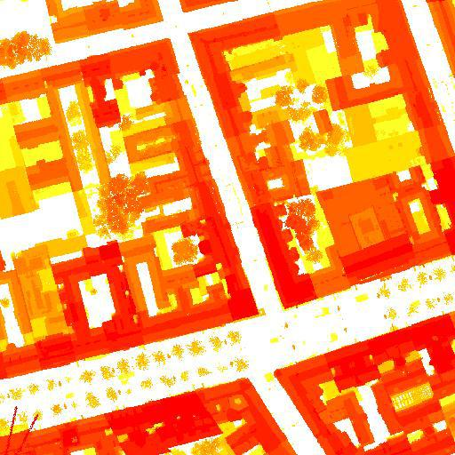

# Architectural Image Datasets

This GitHub repository contains a collection of image-based datasets for architectural applications. The main use of these datasets is for training image-based StyleGAN2ADA and Pix2PixHD workflows. 

Each folder in this repository contains a dataset of images related to a particular architectural theme, such as urban landscapes, interior design, or building facades. In addition to the images themselves, each folder also includes a README file that provides a description of the dataset, the format of the images, and a link to the original source. 

The datasets included in this repository have been used in various architectural projects, and previews of their application are provided within each folder. I also include links to the outcomes of these projects, where the datasets were used to create images or 3D models.

Please note that the use of these datasets is at one's own risk, as some of them were created through automatic image scraping and the licenses for these images may vary. It is the responsibility of the user to ensure that they have the appropriate permissions to use the images in their own work.

I hope that these datasets will be useful for researchers, artists, and developers who are interested in exploring the use of machine learning techniques in architectural design. 

## Urban Scale

### Height Information and Density of Vienna, AT

**[Tesselated HeightMap DataSet](https://drive.google.com/file/d/1yluRfJOm0j5zO3CsAXJ4i0svnm7Y5-RR/view?usp=share_link)**

Segmentation Scale of DataSet is variable. To further reduce scale and increase dataset image count, use this script:

[Batch Image Segmentation .py](/image_processing_tools/image_segmentation_and_stich.py)

In order to preprocess Images for StyleGan2ADA and PIx2PIXHD wokflows refer to:

[Image PreProcessing .py](/image_processing_tools/preprocess_images_ml.py)

## Floorplans

**[Floorplans dataset on Google Drive](https://drive.google.com/drive/folders/your-floorplans-dataset-link)**

## Facades

### Sacral Architecture Motifs

**[Altar DataSet](https://drive.google.com/drive/folders/1DZkYbFLu9nIpemP4tfRJkyxAFVj9qGnn?usp=sharing)**

Model Output Sample

**[Pretrained .plk Model](https://drive.google.com/file/d/1VstC0zJwrWHqJXQcOBqqelSoYdsYy3Ou/view?usp=sharing)**

### Facades of Vienna, AT

**[Altar DataSet](https://drive.google.com/file/d/1Zcs2XAS4YxJJEf3VHqFdR0E5Npr1wqXV/view?usp=sharing)**

Model Output Sample

**[Pretrained .plk Model](https://drive.google.com/file/d/1woaGw76VyJXyjbHZrT710yS5XHSgLq_K/view?usp=sharing)**

## Images

**[Images dataset on Google Drive](https://drive.google.com/drive/folders/your-images-dataset-link)**

I hope this helps! Let me know if you have any further questions.
